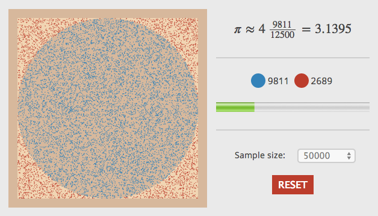

Monte Carlo PI
====

JavaScript code to estimate the value of PI using Monte Carlo simulations

Please go to this [Blog post](http://davidrobles.net/blog/estimating-pi-using-monte-carlo-simulations/) to find a more detailed description on estimating the value of PI using Monte Carlo simulations.

# Demo



# How to Run

```javascript
var model = new MCPI.Model();
var controller = new MCPI.Controller({
    model: model,
    sampleSize: 25000,
    stepSize: 100
});
controller.loop();
```
