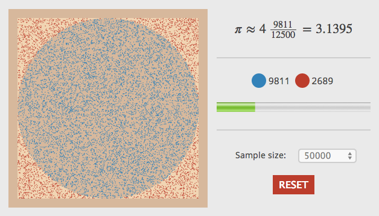

# Monte Carlo PI

This JavaScript program estimates the value of PI using Monte Carlo simulations. Please refer to this [blog post](http://davidrobles.net//blog/2014/06/22/estimating-pi-using-monte-carlo-simulations//) for more information.

## Demo

